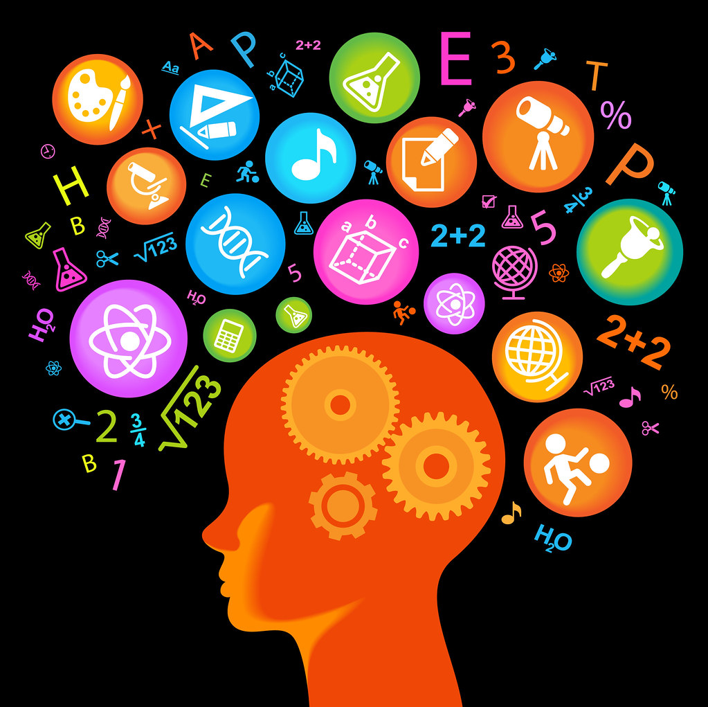
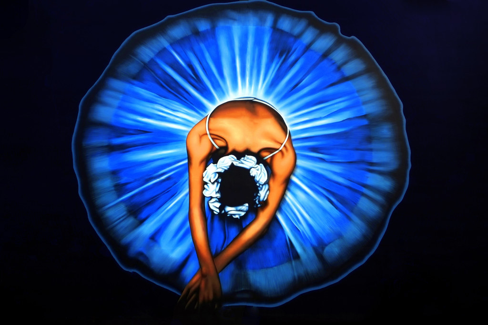

```{r setup, include=FALSE}
knitr::opts_chunk$set(echo = FALSE)
```

Illustration : "Healthy Brain and Severe AD Brain" by National Institutes of Health (NIH) is marked with CC PDM 1.0 

The brain is a very complex organ. It has several biological functions – unconscious functions such as heartbeat, secretion of hormones but also coordination of movements, mental functions. It enables us to think, to move, to learn, to feel, to communicate, … You can compare the brain to a leader of an orchestra. When you have a problem, it finds a solution but when it has a problem…what is the solution? 



You probably have an acquaintance affected by a brain disease (Alzheimer’s, Parkinson’s, brain cancer, schizophrenia, …). You cannot always realize there are ill, but all these diseases destroy people’s life. The sick person can suddenly go mad, forgot everything even his identity, suffer torture or be misfit to social life. At the moment, scientist do not exactly know the causes of these diseases. They carry out research into the effects of several treatments. They hope to find a remedy for all these diseases and in that way improve the sick people’s life. 

I am deeply convinced that brain research can really help the humanity. Furthermore, brain fascinates me. It is very mysterious for ordinary mortal. Scientists in the world frequently make discoveries. Therefore I choose “brain diseases”.  

*Why does it fascinate me? *

The complexity and the mystery. For example, when an [old ballerina touched by Alzheimer’s listens to music](https://www.youtube.com/watch?v=hvvXom7uqUI), she remembers the choreography that she did a lot. Scientists know that music boosts the brain, but they do not know how. I find the brain capacity wonderful. 



