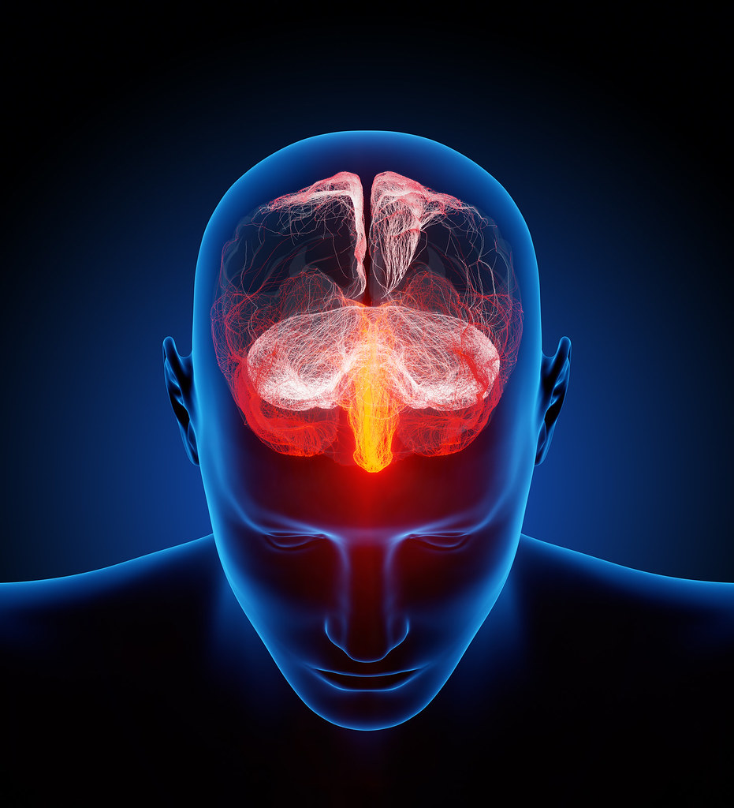

```{r, echo = FALSE, eval = FALSE}
#distill::create_post("my post") # use this fonction to create a new post
```

# Welcome to my blog!

 

Link for the illustration [link](https://search.creativecommons.org/photos/6980f97b-53a0-43ee-9552-3dafda431130)

This blog has been created for English and data courses. You can find three sections.

-	Data Sciences I. 
-	English portfolio. It resumes articles about brain diseases. 
-	M.E.A.L. In this section I tell you what I do to improve my English. 

